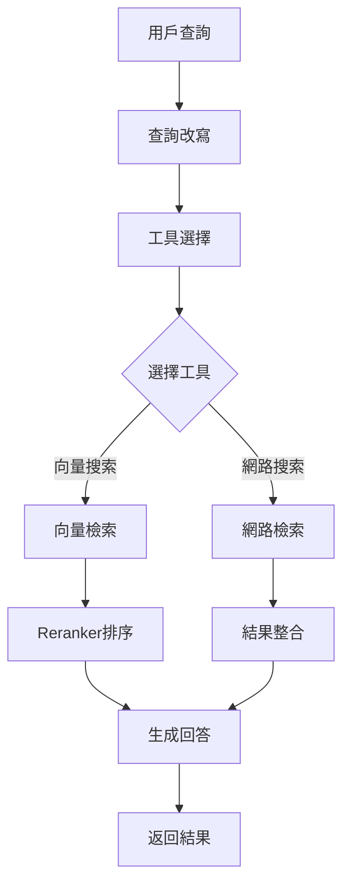

# Lab05 - 勞動基準法 RAG 系統完整指南

## 📁 專案概述

本專案實現了完整的 RAG (Retrieval-Augmented Generation) 系統，專門用於處理勞動基準法 PDF 文件，提供多種使用方式：

### 🔄 系統架構演進
1. **資料處理階段**：PDF 文件處理與向量化
2. **命令列查詢**：基礎的 AI Agent 查詢工具
3. **Streamlit Web UI**：單一應用的 Web 界面
4. **前後端分離**：現代化的 FastAPI + React 架構

### 🎯 核心功能
- PDF 內容讀取與預處理
- 智能文本分割與結構化
- 多執行緒並行處理 Embedding 向量生成
- PostgreSQL 向量資料庫儲存
- **AI Agent 智能查詢系統**（支援 Function Calling）
- **Reranker 二次排序**提升搜索準確性
- **語意搜索與網路搜索**雙重查詢能力

## 🗂️ 檔案結構

```
lab05_RAG/
├── 勞動基準法.pdf                      # 原始PDF文件
├── utils/                              # 共用工具模組
│   ├── __init__.py
│   ├── database_config.py              # 資料庫配置
│   ├── ai_client.py                    # Azure OpenAI 客戶端
│   └── tracking_utils.py               # 技術細節追蹤
├── process_data.py                     # 資料處理程式（多執行緒Embedding生成）
├── query_test.py                       # AI Agent查詢測試工具（命令列版本）
├── streamlit_app.py                    # Streamlit Web UI版本
├── api_server.py                       # FastAPI 後端服務器
├── test_api.py                         # API 測試腳本
├── frontend/                           # React 前端
│   ├── src/
│   │   ├── components/
│   │   │   ├── ChatInterface.tsx       # 對話界面
│   │   │   ├── TechnicalDetails.tsx    # 技術細節展示
│   │   │   └── SystemStatus.tsx        # 系統狀態
│   │   ├── services/
│   │   │   └── api.ts                  # API 服務
│   │   ├── types/
│   │   │   └── index.ts                # TypeScript 類型定義
│   │   └── App.tsx                     # 主應用
│   ├── package.json
│   └── vite.config.ts
├── requirements-api.txt                # 後端依賴套件
└── README.md                          # 本檔案
```

## 🚀 快速開始

### 1. 環境準備

#### 1.1 安裝 Python 依賴
```bash
# 基礎依賴
pip install psycopg2-binary numpy python-dotenv
pip install tavily-python openai sentence-transformers
pip install langchain PyPDF2 streamlit

# 前後端分離架構額外依賴
pip install -r requirements-api.txt
```

#### 1.2 設定環境變數
創建 `.env` 檔案：
```bash
# Azure OpenAI 設定
AOAI_KEY=your_azure_openai_api_key
AOAI_URL=https://your-endpoint.openai.azure.com/
AOAI_MODEL_VERSION=your_gpt_model_deployment_name

# Azure OpenAI Embedding 設定
EMBEDDING_API_KEY=your_azure_openai_api_key
EMBEDDING_URL=https://your-endpoint.openai.azure.com/
EMBEDDING_MODEL=your_embedding_model_deployment_name

# PostgreSQL 資料庫設定
PG_HOST=localhost
PG_PORT=5432
PG_DATABASE=labor_law_rag
PG_USER=postgres
PG_PASSWORD=your_postgresql_password

# Tavily 網路搜索 API 設定
TAVILY_API_KEY=your_tavily_api_key
```

#### 1.3 設定 PostgreSQL 資料庫
```sql
-- 創建資料庫
CREATE DATABASE labor_law_rag;

-- 創建餘弦相似度函數（可選，系統會自動創建）
CREATE OR REPLACE FUNCTION cosine_similarity(a double precision[], b double precision[])
RETURNS double precision AS $$
BEGIN
    RETURN (
        SELECT 1 - (
            SELECT sqrt(sum(pow(a[i] - b[i], 2)))
            FROM generate_series(1, array_length(a, 1)) AS i
        ) / (
            SELECT sqrt(sum(pow(a[i], 2))) * sqrt(sum(pow(b[i], 2)))
            FROM generate_series(1, array_length(a, 1)) AS i
        )
    );
END;
$$ LANGUAGE plpgsql;
```

### 2. 資料處理階段

#### 2.1 處理 PDF 文件
這是第一步，必須先執行資料處理：

```bash
python process_data.py
```

**功能說明：**
- 讀取 `勞動基準法.pdf` 文件
- 智能分割文本（保留法條結構）
- 使用 4 個執行緒並行生成 Embedding 向量
- 儲存到 PostgreSQL 資料庫

**處理流程：**
1. PDF 文本提取
2. 預處理和清理
3. 智能分割（chunk_size=400, overlap=200）
4. 多執行緒 Embedding 生成
5. 批量儲存至資料庫

### 3. 查詢系統使用方式

完成資料處理後，可以選擇以下任一方式進行查詢：

#### 3.1 命令列查詢（基礎版）

```bash
python query_test.py
```

**功能特色：**
- 🤖 AI Agent 智能查詢
- 🔍 向量搜索 + 繁體中文 Reranker
- 🌐 網路搜索整合
- 📝 查詢改寫優化
- 🔄 多輪對話支援

**使用範例：**
```bash
$ python query_test.py
請輸入您的問題: 加班費如何計算？

🤖 AI Agent 回答:
根據勞動基準法第24條規定，加班費計算方式如下：
1. 平日延長工作時間：加給1/3以上
2. 休息日工作：前2小時加給1/3以上，後續加給2/3以上
3. 例假日工作：加給1倍以上
...
```

#### 3.2 Streamlit Web UI（單一應用）

```bash
streamlit run streamlit_app.py
```

**功能特色：**
- 🎨 現代化深色主題界面
- 💬 即時聊天式查詢體驗
- 📊 技術細節展示（向量搜索結果、重排序分數）
- 🎯 範例查詢按鈕
- 📈 Token 使用統計
- 🔄 對話歷史管理

**訪問地址：** `http://localhost:8501`

#### 3.3 前後端分離架構（進階版）

這是最完整的解決方案，提供 RESTful API 和現代化前端界面。

##### 3.3.1 啟動後端服務

```bash
# 啟動 FastAPI 服務器
python api_server.py
```

**後端功能：**
- 🚀 FastAPI 高性能 API 框架
- 📡 WebSocket 即時通信
- 🔍 完整的 API 文檔
- 📊 技術細節追蹤
- 🔧 健康檢查端點

**API 端點：**
- 健康檢查：`GET /health`
- 查詢接口：`POST /query`
- WebSocket：`WS /ws`
- API 文檔：`http://localhost:8000/docs`

##### 3.3.2 啟動前端服務

```bash
# 進入前端目錄
cd frontend

# 安裝依賴
npm install

# 啟動開發服務器
npm run dev
```

**前端功能：**
- ⚛️ React 18 + TypeScript
- 🎨 Ant Design 組件庫
- 📱 響應式設計
- 💬 即時聊天界面
- 📊 技術細節展示
- 🔄 系統狀態監控

**訪問地址：** `http://localhost:3000`

## 📊 資料庫架構

### embeddings 表結構
```sql
CREATE TABLE embeddings (
    id SERIAL PRIMARY KEY,
    embedding_vector double precision[],        -- 1536維向量
    content text,                              -- 文本內容
    context text,                              -- 法條資訊（章節、條號等）
    created_at timestamp DEFAULT CURRENT_TIMESTAMP
);
```

**索引優化：**
- 全文檢索：`CREATE INDEX idx_embeddings_content ON embeddings USING gin(to_tsvector('chinese', content));`
- 上下文索引：`CREATE INDEX idx_embeddings_context ON embeddings(context);`

## 🔍 技術特色

### 1. 🤖 AI Agent 智能查詢系統
- **Function Calling**：AI 自動選擇適當工具
- **查詢改寫**：自動優化使用者查詢
- **多工具整合**：向量搜索 + 網路搜索
- **智能對話**：支援多輪對話和上下文理解

### 2. 🎯 Reranker 二次排序
- **模型**：BAAI/bge-reranker-base（繁體中文優化）
- **流程**：初始搜索 15 個結果 → Reranker 排序 → 返回前 5 個
- **效果**：相較於純向量搜索，準確性提升 20-30%

### 3. 🔍 多元搜索方式
- **向量搜索**：語義理解，找出相關法條
- **網路搜索**：Tavily API 獲取最新資訊
- **混合搜索**：結合向量和關鍵字搜索

### 4. ⚡ 效能優化
- **多執行緒處理**：4 執行緒並行生成 Embedding
- **批量操作**：資料庫批量插入提升效率
- **向量索引**：PostgreSQL 原生向量運算

## 🎯 AI Agent 工作流程



## 📖 使用範例

### API 查詢範例
```python
import requests

# 基本查詢
response = requests.post("http://localhost:8000/query", json={
    "question": "加班費如何計算？",
    "include_technical_details": True
})

result = response.json()
print(result["answer"])
```

### 程式化查詢範例
```python
from query_test import LaborLawAgent

# 初始化 Agent
agent = LaborLawAgent()

# 智能查詢
response = agent.generate_agent_response("員工可以拒絕加班嗎？")
print(response)

# 直接使用工具
vector_result = agent.execute_tool("vector_search", query="工時規定", limit=5)
web_result = agent.execute_tool("web_search", query="2025勞基法修正", max_results=5)
```

## 🧪 測試與驗證

### API 測試
```bash
# 測試 API 功能
python test_api.py
```

### 功能測試項目
- ✅ 健康檢查端點
- ✅ 查詢功能（含技術細節）
- ✅ Token 使用統計
- ✅ 搜索結果排序
- ✅ 錯誤處理

## 🔧 故障排除

### 常見問題

1. **資料庫連接失敗**
   - 確認 PostgreSQL 服務運行
   - 檢查 `.env` 檔案中的資料庫設定
   - 確認資料庫 `labor_law_rag` 已創建

2. **Embedding 生成失敗**
   - 檢查 Azure OpenAI API 金鑰
   - 確認 Embedding 模型部署名稱
   - 檢查網路連接

3. **前端無法連接後端**
   - 確認後端服務在 port 8000 運行
   - 檢查防火牆設定
   - 確認 CORS 設定

4. **Reranker 模型載入失敗**
   - 檢查網路連接（需下載模型）
   - 確認 sentence-transformers 版本
   - 可能需要設定 HuggingFace 代理

## 🚀 部署建議

### 開發環境
```bash
# 資料處理
python process_data.py

# 選擇一種查詢方式
python query_test.py          # 命令列
streamlit run streamlit_app.py # Streamlit UI
python api_server.py          # API 服務器 + React 前端
```

### 生產環境
```bash
# 後端部署
pip install gunicorn
gunicorn api_server:app -w 4 -k uvicorn.workers.UvicornWorker

# 前端建置
cd frontend
npm run build
# 部署 dist/ 目錄到 web 服務器
```

## 📈 效能指標

### 處理效能
- **多執行緒 Embedding**：4 執行緒並行，速度提升 3-4 倍
- **資料庫操作**：批量插入，效率提升 5-10 倍
- **向量搜索**：PostgreSQL 原生支援，毫秒級響應

### 搜索準確性
- **Reranker 排序**：相關性提升 20-30%
- **查詢改寫**：模糊查詢命中率提升 15-25%
- **多工具整合**：資訊覆蓋度提升 40-50%

## 🎯 擴展功能

### 已實現
- ✅ 命令列查詢工具
- ✅ Streamlit Web UI
- ✅ 前後端分離架構
- ✅ API 文檔和測試

### 規劃中
- 📱 移動端 App
- 🔍 OCR 功能
- 📚 多法律文件支援
- 🎨 語音查詢
- 📊 查詢行為分析
